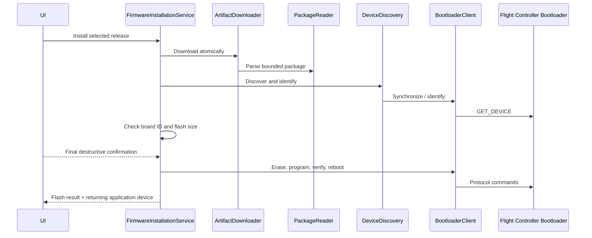

# Firmware installation

## Scope and user modes

The modern firmware feature installs ArduPilot application firmware through the ArduPilot serial bootloader and can request an embedded bootloader update through an already connected vehicle. It deliberately separates these workflows:

- Connected: normal application flashing, catalogue tiles, and custom-file actions are unavailable. A supported, disarmed ArduPilot vehicle may run the separately confirmed Bootloader Update command.
- Disconnected: Stable, Beta, Latest, All Options, and local `.apj`/`.px4` packages are available. A normal Mission Planner connection must release the transport before installation.
- Operation in progress: progress replaces normal actions, duplicate commands are rejected, and Shell navigation is cancelled while an unsafe operation owns the page.
- Unsupported platform: the page explains that direct installation is unavailable.

## Architecture and dependency rules

`MissionPlanner.Firmware` owns immutable models, manifest/catalogue handling, package validation, operation policy, device discovery, compatibility, protocol, recovery matching, and orchestration. `MissionPlanner.App` owns pages, file selection, dialogs, navigation policy, clipboard integration, and platform presentation. `MissionPlanner.Core` adapts the existing acknowledged MAVLink command infrastructure. The firmware project has no MAUI dependency and must remain UI-neutral.

## Installation sequence

## Catalogue and package handling

The ArduPilot manifest is retrieved over HTTPS with separate compressed-download and decompressed-document bounds, parsed into normalized data, cached with validators, and filterable by vehicle, release channel, board ID, and USB identity. Current official entries expose decoded application size as `image_size`; encoded artifact length is optional and is enforced exactly only when supplied. Stale cached data is distinguishable from a fresh response. Catalogue choices expose the complete matching hardware-target set and search platform, manufacturer/brand, and board ID instead of collapsing a vehicle family to its first entry. Automatic target selection requires one unambiguous high-confidence USB or bootloader-alias match; otherwise selection remains explicit and labelled with its evidence.

APJ and PX4 GCS packages are JSON containers. Parsing checks their magic, declared and configured size limits, compressed image length, board metadata, optional external image, revision requirements, and checksum inputs before device access. Downloads use a bounded temporary file, validate length and optional SHA-256, parse it, then move it atomically into cache. Temporary and selected-file streams are disposed on every path.

`IFirmwarePreparationService` provides the non-destructive Download & Validate boundary. It downloads or reuses the immutable cache artifact, reparses it, verifies the manifest/package board ID, and returns package sizes, SHA-256, timestamp, cache identity, and warnings without depending on device discovery or serial services. Install Validated Firmware passes the prepared package directly to installation and does not redownload it.

Artifact storage uses the injected durable firmware cache root rather than `%TEMP%`. Each entry is staged in a private partial directory and published only after both bytes and JSON metadata are durable. Reads recheck metadata size and the downloader rechecks SHA-256/package validity. The store exposes enumeration and removal, cleans orphan partials, serializes same-key publication, and applies configurable age and byte-quota retention.

The catalogue cache layers an in-process value over a durable host-selected cache root. It persists source URI, ETag, Last-Modified, retrieval time, content, and schema version through an atomic replacement. A new process can reuse a fresh manifest or its HTTP validators; corrupt and incompatible cache records are ignored, while `FirmwareCatalogService` retains a valid stale entry when refresh fails.

Manifest and artifact traffic uses the named `MissionPlanner.Firmware` client with a configurable MissionPlanner User-Agent, bounded request timeout, bounded connection establishment, and gzip/deflate decompression. Manifest and artifact readers still enforce independent streaming byte limits and propagate caller cancellation. Large artifact downloads have no automatic retry policy.

Manifest entries are parsed independently. Invalid URLs, board IDs, USB identifiers, unsupported formats, and missing required fields skip only the affected entry and produce categorized counts; unknown future fields remain in raw metadata. Invalid JSON/gzip and manifests with no usable entries still fail as a whole. Equivalent mirror entries are deterministically deduplicated and reported.

Catalogue refresh is latest-request-wins. Selecting a new release channel cancels the preceding request and invalidates late responses; only the current response applies a single collection snapshot on the UI dispatcher. The page exposes catalogue-refresh activity and retains an explicitly selected target while that exact board/channel/artifact remains available.

Supported image formats in this workflow are `.apj` and `.px4`. Intel HEX, `_with_bl.hex`, DFU, legacy boards, DroneCAN, BlueOS/network upload, SD-card `.abin`, UART telemetry adapters, and mobile USB-host flashing are not implemented. `.hex` requires a future DFU/legacy workflow.

The separate DFU architecture now has platform-neutral contracts under `MissionPlanner.Firmware.Dfu` for STM32 USB device evidence, tool/provider capabilities, bounded Intel HEX inspection, artifacts and address ranges, controlled process execution, progress, and typed results. DFU remains distinct from serial ports and serial bootloader clients, while sharing the global firmware-operation lease so destructive workflows cannot overlap. Provider, parser, Windows discovery, and orchestration implementations follow in later tasks.

## Serial ownership, protocol, and recovery

Only one firmware operation may own serial resources. Discovery snapshots devices, prioritizes explicit/new/USB-matching candidates, opens each candidate exclusively with bounded timeouts, and accepts it only after bootloader synchronization and identity. Rejected ports are closed immediately. Port names are treated as transient. Mode changes that reuse the same stable identity and COM port are still treated as a new device generation when USB/product descriptors change.

When a disconnected application-mode port is available, the host can create an isolated, one-shot MAVLink parser over that exclusively opened serial stream, wait for a bounded heartbeat, send reboot-to-bootloader, interpret an ACK when one arrives, and dispose the stream before discovery starts. It never starts or reuses the normal Mission Planner vehicle session.

Detected application devices remain typed through the UI and installation request. The page auto-selects only one uniquely recommended USB/board-hint match; ambiguous candidates require explicit selection and show the recommendation reason. The selected descriptor is supplied both to bootloader entry and discovery, enabling temporary MAVLink reboot while retaining identity across a COM-port change.

The protocol client implements bounded synchronization, identify, erase, chunked program, checksum verification, and reboot operations. Board identity and writable size are known before erase. Verification is mandatory; a checksum mismatch can never report success.

After reboot, recovery observes bootloader removal and matches the returning application using USB serial, stable OS path, VID/PID, product transition, and operation timing. A new COM name is expected and reported. Failure to rediscover the application does not invalidate a verified flash: the result is “flash succeeded; reconnect not detected.” The firmware library never reuses an old MAVLink parser, channel, or pending registration and never reconstructs the application session automatically.

## State, safety, and cancellation

The guarded lifecycle is Idle → catalogue/package/device/bootloader stages → compatibility → Erasing → Programming → Verifying → Rebooting → WaitingForApplication → Completed, with typed Failed and Cancelled terminals. Invalid transitions throw. Connection state is checked again in the installation service, so UI state alone cannot bypass the disconnected requirement.

Board ID, revision, image size, flash capacity, external-flash, bootloader revision, and supported security metadata are checked before erase. The final prompt repeats detected and selected board IDs and image size. The page offers Cancel during catalogue loading, download/validation, device and bootloader discovery, compatibility checks, and application rediscovery. Before erase, Cancel stops the active operation-owned token immediately. During erase/program/verify/reboot, the request is recorded and the UI explains that power must remain connected; protocol calls retain their non-cancellable token, complete verification and reboot, dispose the serial port, then terminate as Cancelled at the safe `WaitingForApplication` boundary. Navigation remains blocked throughout destructive work. All protocol reads and discovery loops have bounded timeouts.

Host interaction prompts use the shared `FirmwareInteractionCodes` contract rather than duplicated UI strings. Both final confirmation and manual bootloader requests preserve the operator's Boolean response. Rejecting either request ends the operation as Cancelled before erase; cancellation from the caller token remains independently observable as cancellation rather than acceptance.

Embedded Bootloader Update uses `MAV_CMD_FLASH_BOOTLOADER` (42650), confirmation value 290876 in parameter 5, the existing command/ACK service, an explicit warning, and connected/supported/disarmed gates. Accepted, temporary rejection, denial, unsupported, failure, and timeout remain distinct outcomes.

## Platforms

Direct serial installation is enabled for Windows desktop, the first supported host. Windows provides enriched device identity through its serial-device catalogue. Linux, Mac Catalyst, and mobile targets show unsupported mode until tested platform adapters exist. Automated protocol tests use in-memory transports and require no hardware.

## Embedded help and support

The firmware page includes a keyboard-accessible Help & Support area whose essential guidance is compiled into the application and remains usable offline. It explains exact-target selection, release risk, APJ/PX4/HEX and bootloader image types, serial installation versus STM32 ROM DFU, boot entry, Windows enumeration, driver/tool priority, platform limits, recovery, and diagnostic evidence. External destinations come from one HTTPS-only curated catalogue and supplement rather than replace embedded instructions. Windows Device Manager is launched only through a host service and is hidden on other platforms. Context guidance is derived from typed presentation evidence rather than raw exception messages.

## DFU artifact inspection

Every DFU Intel HEX artifact is parsed before it can reach an external programming provider. The platform-neutral inspector bounds encoded input, unique data bytes, and represented address span; validates record structure, checksums, EOF, address arithmetic, duplicates, and overlaps; and rejects data outside a configurable conservative STM32 internal-flash range. It returns compact sorted ranges rather than allocating sparse address gaps. Bootloader and application-region flags are evidence for later target-safety decisions, never proof of the connected board identity.

## Windows USB DFU discovery

Windows DFU discovery reads present Plug and Play USB instances directly and therefore does not require or infer a COM port. The initial catalogue selects the configured STM32 system-bootloader identity (`VID 0483`, `PID DF11` by default), retains PnP instance, friendly-name, manufacturer, USB serial, driver service/provider/version, and problem-code evidence where Windows exposes it, and maps absence, ready, wrong-driver, device-problem, busy, and unknown states distinctly. Registry device-change notification prompts immediate snapshots while a bounded polling deadline remains the fallback. Arrival timestamps belong to each continuous presence generation and are reset after removal.

## STM32CubeProgrammer dependency

DFU programming uses an externally installed `STM32_Programmer_CLI.exe`; Mission Planner does not bundle, download, or install it. Windows discovery checks an operator-configured executable first, then known ST installation directories, relevant uninstall registry entries, and optionally `PATH`. The executable name and existence are validated before a bounded direct `--version` probe, and Windows file-version metadata is preferred when provider output is localized. Availability distinguishes not installed, invalid configured path, unsupported version, blocked execution, and validated availability. The configured minimum version is enforced before the tool can be selected by the DFU workflow.

External-provider execution always uses a direct no-shell process with individual `ArgumentList` values. The process runner accepts only the CubeProgrammer executable and one of the typed validation, USB-list, USB-inspection, or program-and-verify argument shapes; arbitrary executables and argument sequences are rejected before process creation. Startup, total execution, retained line count, and retained character count are bounded. Standard output and error remain separately timestamped, exit code and truncation are explicit, and invalid UTF-8 is preserved with replacement characters. Cancellation kills a process tree only when the provider request explicitly declares that stage safe; otherwise it waits for a safe exit or returns at the bounded deadline without terminating the provider.

## Troubleshooting

- Catalogue unavailable: retry Refresh; a valid cached catalogue may be shown as stale.
- Vehicle connected: disconnect it through Mission Planner before normal installation.
- Bootloader not found: unplug/replug the controller or use its reset button; confirm no other program owns the serial port.
- Board mismatch or insufficient flash: select firmware for the detected board. These checks cannot be overridden in the initial implementation.
- Verification failed: do not treat the controller as updated; copy the diagnostic report and retry only after checking cable and power.
- Flash completed but reconnect not detected: reconnect manually and select the newly enumerated port. The flash itself remains successful.
- Embedded update denied/unsupported: preserve the reported ACK outcome and verify the vehicle family, disarmed state, firmware support, and permissions.

Run the [Firmware Download user protocol](tasks/firmware/Step-2/02-Firmware-Download-User-Test-Protocol.md) first to validate catalogue, target, package, cache, offline, and cancellation behavior without hardware. The separate operator procedure and evidence record for required physical F4/H7 validation is maintained in [Hardware smoke test](tasks/firmware/Hardware%20smoke%20test.md). Pending entries are not release evidence.

## Diagnostics and attribution

Structured logs and the copyable report include operation ID, source, board identities, device transitions, stage, programmed size, verification, failure code, and elapsed time. Firmware bytes, unbounded responses, secrets, and signing material are never logged.

Protocol behavior, manifest/APJ conventions, command semantics, and workflow expectations are derived from the upstream [ArduPilot bootloader documentation](https://ardupilot.org/dev/docs/bootloader.html), [pre-built binary documentation](https://ardupilot.org/dev/docs/pre-built-binaries.html), and [bootloader update documentation](https://ardupilot.org/copter/docs/common-bootloader-update.html). ArduPilot is GPLv3; see its [licence documentation](https://ardupilot.org/dev/docs/license-gplv3.html). This implementation is a clean integration in Mission Planner’s repository and retains the repository’s licensing obligations.

## Existing mandatory-hardware firmware section

The separate mandatory-hardware Setup section continues to display firmware identity from `HEARTBEAT` and `AUTOPILOT_VERSION` and uses the older `FirmwareManifestSelector`, `FirmwarePackageManager`, and `FirmwareUpdateCoordinator` abstractions. Its configured manifest entries require technical family/board/vendor/product matching and HTTPS/SHA-256 validation; labels are never binary-selection keys. `UnsupportedFirmwareFlashingService` remains its default adapter. That workflow and the modern direct bootloader page must not share or retain live serial/MAVLink ownership across a reboot transition.
